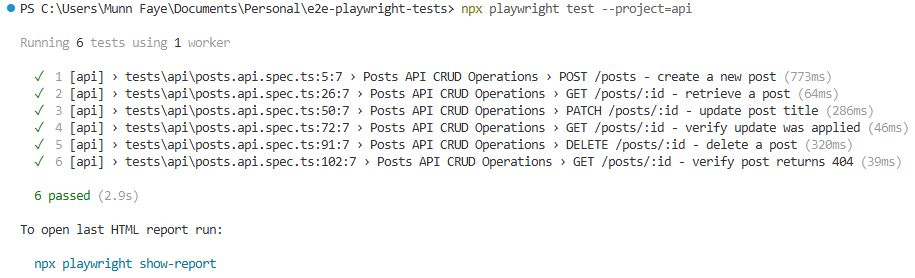
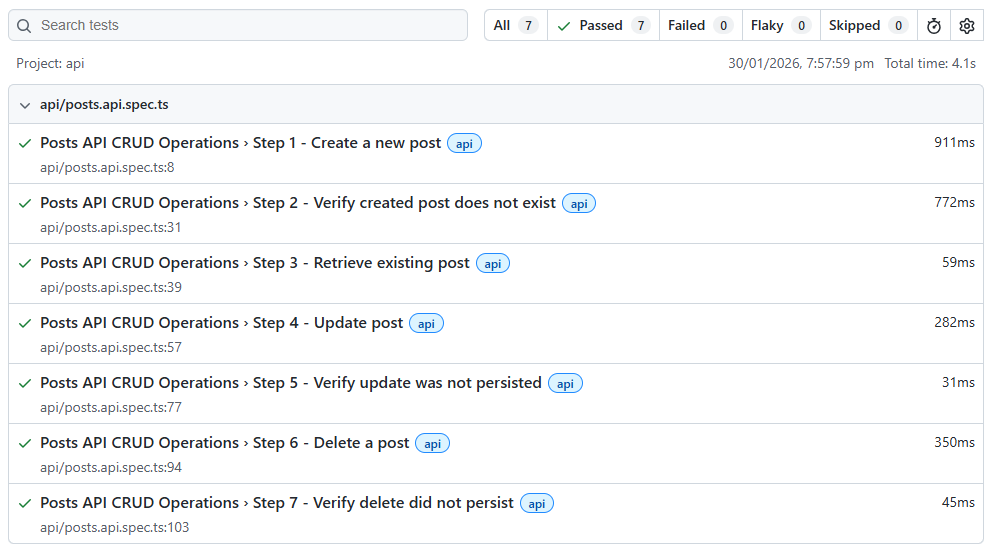
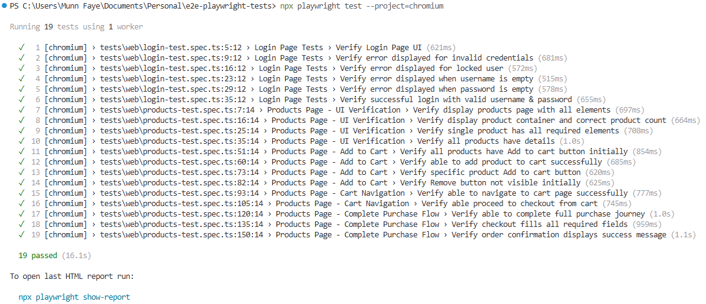
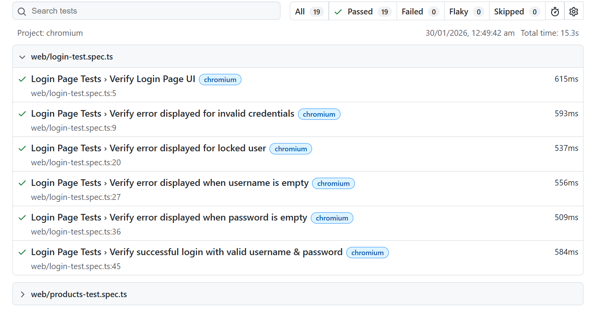
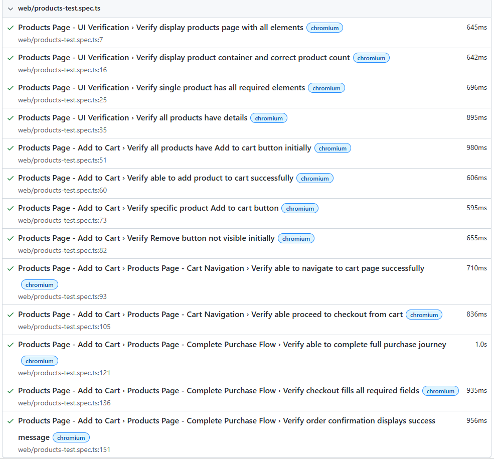

# E2E-PLAYWRIGHT-TESTS

End-to-end testing project using Playwright with TypeScript for web and API automation.

## Prerequisites

Before you start, you should have the following installed:
- Node.js (v16 or higher)
- npm or yarn package manager

**Versions used:**
- Node.js: v25.4.0
- npm: 11.7.0

## Installation

1. Clone the repository:
```bash
git clone https://github.com/yourusername/e2e-playwright-test.git
cd e2e-playwright test
```

2. Install dependencies:
```bash
npm install
```

3. Install Playwright browsers:
```bash
npx playwright install
```

## Project Structure

```
E2E-PLAYWRIGHT-TESTS/
├── assets/
│   ├── api-console-output.png
│   ├── api-html-report.png
│   ├── web-console-output.png
│   ├── web-html-report-part1.png
│   └── web-html-report-part2.png
├── config/
│   └── testSetup.ts
├── constants/
│   ├── testData.ts
│   ├── uiConstants.ts
│   └── validationMessages.ts
├── locators/
│   └── selectors.ts
├── pages/
│   ├── base.page.ts
│   ├── login.page.ts
│   └── products.page.ts
├── tests/
│   ├── api/
│   │   └── posts.api.spec.ts
│   └── web/
│       ├── login-test.spec.ts
│       └── products-test.spec.ts
├── types/
│   └── checkout.ts
├── playwright-report/
├── test-results/
├── playwright.config.ts
└── package.json
```

## Running Tests

### Run all tests
```bash
npx playwright test
```

### Run web tests only
```bash
npx playwright test --project=chromium
```

### Run API tests only
```bash
npx playwright test --project=api
```

## Test Reports

### View HTML report
```bash
npx playwright show-report
```

Reports are generated in the `playwright-report/` folder.

## Test Results

### API Tests
#### Console Output


#### HTML Report


### Web Tests
#### Console Output


#### HTML Report



## Contact

For questions or support, please open an issue in the repository.